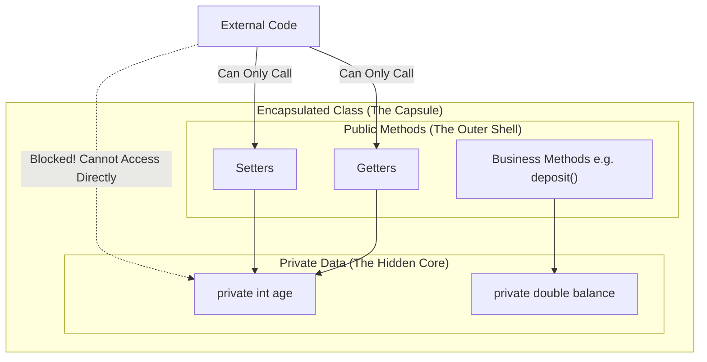

# Encapsulation: Theoretical Notes

## 1. Encapsulation (Data Hiding)

Encapsulation is one of the four fundamental pillars of Object-Oriented Programming (alongside Inheritance, Polymorphism, and Abstraction).

### The Concept
At its core, Encapsulation is the mechanism of wrapping the **data (variables)** and the **code acting on the data (methods)** together as a single unit. In encapsulation, the variables of a class will be hidden from other classes, and can be accessed only through the methods of their current class. Therefore, it is also known as **Data Hiding**.

### Graphical Representation
Imagine a medicinal capsule. The active medicine (data) is securely hidden inside the hard outer shell (methods). The outside world (other code) interacts with the shell, not the raw medicine directly.

### Why do we need Encapsulation?
1. **Control & Security:** By making data `private`, you prevent external code from making arbitrary, destructive changes (e.g., setting a bank balance to `-9999`). 
2. **Data Validation:** By forcing other classes to use a `public` setter method to change the data, you can write `if/else` logic inside the setter to validate the input before allowing the data to change.
3. **Flexibility / Maintenance:** You can change the internal implementation of a class without breaking the code of anyone else who is using your class. As long as the names of the public getters/setters don't change, the external code doesn't care how the data is stored internally.
4. **Read-Only / Immutable Objects:** By completely removing setter methods and only providing getter methods, you can create objects that can never be modified after they are created (e.g., the Java `String` class).

---

## 2. Core OOP Keywords & Concepts (Interview Prep)

When discussing the foundations of classes and objects, you must deeply understand the following terminology.

### Constructors (Default vs. Parameterized)
A constructor is a special block of code that runs immediately when an object is created using the `new` keyword. It has **no return type** and must perfectly match the class name.
- **Default Constructor:** A constructor with zero parameters. If you write a class without *any* constructors, the Java Compiler automatically inserts an invisible, empty default constructor for you.
- **Parameterized Constructor:** A constructor that accepts arguments (e.g., `public Person(String name)`), allowing you to pass initial data directly into the object upon creation. 
- **The Trap:** If you manually write a parameterized constructor, Java **revokes** your free default constructor. If you still want to be able to create an object without passing parameters, you must manually write out the default constructor as well!

### Getters and Setters
Because encapsulation requires variables to be `private`, they cannot be read or modified by the outside world directly.
- **Getters (Accessors):** Public methods that return the value of a private variable. They allow external code to *read* data securely.
- **Setters (Mutators):** Public methods that take a parameter and assign it to a private variable. They allow external code to *write* data securely. (Crucially, you can put `if/else` validation logic inside a setter to reject bad data).

### The `this` Keyword
The `this` keyword is a reference variable that points to the **current object instance** on which a method or constructor is being invoked.
- **Primary Use:** To resolve naming collisions. If your class variable is named `age`, and your constructor parameter is also named `age`, writing `this.age = age;` tells the compiler: *"Set the object's age (this.age) equal to the parameter's age (age)."*

### The `this()` and `super()` Methods
These look similar to the `this` keyword, but the parenthesis `()` mean they are making method calls—specifically, constructor calls. **Rule:** If used, they MUST be the very first line of code inside a constructor.
- **`this()` Method:** Used for **Constructor Chaining**. It calls another constructor residing within the *same* class. (e.g., Calling the parameterized constructor from inside the default constructor to provide default values).
- **`super()` Method:** Used to call the constructor of the **Parent (Super)** class. If you don't write it, Java implicitly inserts a blank `super();` on the first line of every constructor to ensure the inheritance chain is properly initialized.

### `static` Methods
When a method is marked as `static`, it belongs to the **Class blueprint itself**, rather than to individual object instances.
- **How to call:** You call them using the class name (e.g., `Math.max(5, 10)`), not on an object variable.
- **The Golden Rule:** A static method **cannot use the `this` keyword**, nor can it access non-static instance variables. Why? Because `this` refers to a specific object, and static methods run independently of any specific object!
