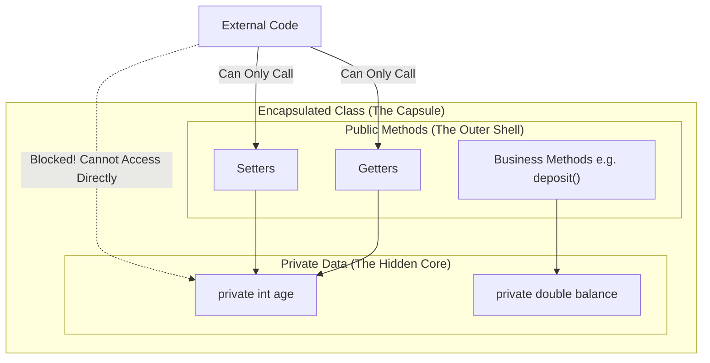

# OOP Theoretical Notes

## 1. Memory Management: Stack vs. Heap Memory

When a Java program runs, the JVM divides the available memory into several distinct areas. The two most important areas for object-oriented programming are the Stack and the Heap.

### The Stack Memory (Local Variables & Method Calls)
The Stack is a highly organized, linear memory space used for thread execution. It operates on a Last-In, First-Out (LIFO) principle.
- **What goes here:** The Stack stores **local variables** (primitives like `int`, `double`, `boolean` declared inside a method) and the execution history of method calls. It also stores **references** (the memory addresses) to objects, but not the objects themselves.
- **How it works:** Whenever you call a method in Java, a new block of memory called a "Stack Frame" is instantly created at the top of the Stack. This frame holds all the local variables for that specific method.
- **Lifecycle:** The lifecycle of variables on the Stack is strictly tied to their method. As soon as a method finishes executing, its Stack Frame is immediately "popped" off the stack, and all its local variables are destroyed and cleared from memory instantly. 
- **Performance:** Because of this strict, sequential behavior, allocating and deallocating memory on the Stack is incredibly fast. However, the Stack size is very limited. If you have too many nested method calls (like infinite recursion), the Stack will run out of space and throw a `StackOverflowError`.

### The Heap Memory (Objects & Instance Variables)
The Heap is a massive, unstructured pool of memory used for dynamic allocation. 
- **What goes here:** The Heap stores **all objects**, no matter where or how they were created, as well as their **instance variables** (the state/properties belonging to that object). Even if an object is created inside a method, the object itself goes to the Heap, while only a small reference variable (acting like a remote control) is placed on the Stack to point to it.
- **How it works:** Because objects can vary wildly in size and their lifespan isn't neatly tied to a single method call, they cannot be stored in the rigid Stack. Instead, they are placed in the Heap, where they can be shared globally across multiple methods and threads. 
- **Lifecycle:** Variables on the Heap do not die when a method ends. An object will remain in the Heap for as long as there is at least one active reference pointing to it from the Stack. When an object has no more references pointing to it (it becomes "unreachable"), the JVM's Garbage Collector automatically identifies it and destroys it to free up memory.
- **Performance:** Accessing data on the Heap is slower than the Stack because it requires following pointers, and memory management is more complex. If your application creates too many large objects and fills up the Heap, it will throw an `OutOfMemoryError`.

---

## 2. Encapsulation (Data Hiding)

Encapsulation is one of the four fundamental pillars of Object-Oriented Programming (alongside Inheritance, Polymorphism, and Abstraction).

### The Concept
At its core, Encapsulation is the mechanism of wrapping the **data (variables)** and the **code acting on the data (methods)** together as a single unit. In encapsulation, the variables of a class will be hidden from other classes, and can be accessed only through the methods of their current class. Therefore, it is also known as **Data Hiding**.

### Graphical Representation
Imagine a medicinal capsule. The active medicine (data) is securely hidden inside the hard outer shell (methods). The outside world (other code) interacts with the shell, not the raw medicine directly.

### Why do we need Encapsulation?
1. **Control & Security:** By making data `private`, you prevent external code from making arbitrary, destructive changes (e.g., setting a bank balance to `-9999`). 
2. **Data Validation:** By forcing other classes to use a `public` setter method to change the data, you can write `if/else` logic inside the setter to validate the input before allowing the data to change.
3. **Flexibility / Maintenance:** You can change the internal implementation of a class without breaking the code of anyone else who is using your class. As long as the names of the public getters/setters don't change, the external code doesn't care how the data is stored internally.
4. **Read-Only / Immutable Objects:** By completely removing setter methods and only providing getter methods, you can create objects that can never be modified after they are created (e.g., the Java `String` class).

---

## 3. Core OOP Keywords & Concepts (Interview Prep)

When discussing the foundations of classes and objects, you must deeply understand the following terminology.

### Constructors (Default vs. Parameterized)
A constructor is a special block of code that runs immediately when an object is created using the `new` keyword. It has **no return type** and must perfectly match the class name.
- **Default Constructor:** A constructor with zero parameters. If you write a class without *any* constructors, the Java Compiler automatically inserts an invisible, empty default constructor for you.
- **Parameterized Constructor:** A constructor that accepts arguments (e.g., `public Person(String name)`), allowing you to pass initial data directly into the object upon creation. 
- **The Trap:** If you manually write a parameterized constructor, Java **revokes** your free default constructor. If you still want to be able to create an object without passing parameters, you must manually write out the default constructor as well!

### Getters and Setters
Because encapsulation requires variables to be `private`, they cannot be read or modified by the outside world directly.
- **Getters (Accessors):** Public methods that return the value of a private variable. They allow external code to *read* data securely.
- **Setters (Mutators):** Public methods that take a parameter and assign it to a private variable. They allow external code to *write* data securely. (Crucially, you can put `if/else` validation logic inside a setter to reject bad data).

### The `this` Keyword
The `this` keyword is a reference variable that points to the **current object instance** on which a method or constructor is being invoked.
- **Primary Use:** To resolve naming collisions. If your class variable is named `age`, and your constructor parameter is also named `age`, writing `this.age = age;` tells the compiler: *"Set the object's age (this.age) equal to the parameter's age (age)."*

### The `this()` and `super()` Methods
These look similar to the `this` keyword, but the parenthesis `()` mean they are making method calls—specifically, constructor calls. **Rule:** If used, they MUST be the very first line of code inside a constructor.
- **`this()` Method:** Used for **Constructor Chaining**. It calls another constructor residing within the *same* class. (e.g., Calling the parameterized constructor from inside the default constructor to provide default values).
- **`super()` Method:** Used to call the constructor of the **Parent (Super)** class. If you don't write it, Java implicitly inserts a blank `super();` on the first line of every constructor to ensure the inheritance chain is properly initialized.

### `static` Methods
When a method is marked as `static`, it belongs to the **Class blueprint itself**, rather than to individual object instances.
- **How to call:** You call them using the class name (e.g., `Math.max(5, 10)`), not on an object variable.
- **The Golden Rule:** A static method **cannot use the `this` keyword**, nor can it access non-static instance variables. Why? Because `this` refers to a specific object, and static methods run independently of any specific object!
